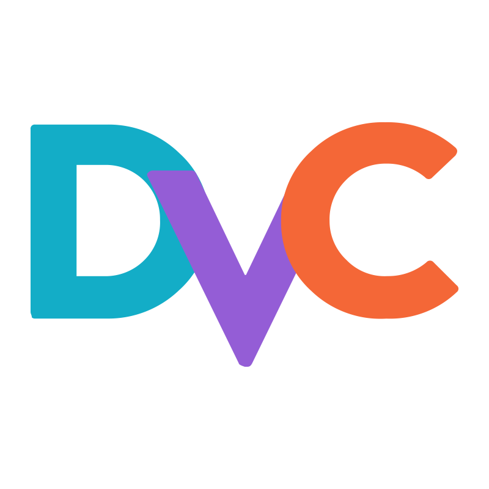

<h1 align="center">Hi 👋, I'm Shariful Islam </h1>
<h3 align="center">
 Fast learner and eager to explore new technologies. Believer in agile software development, team work and clean code. Currenlty am learning Machine Learning and want to take up a role as Data Scientist or Machine Learning Engineer. 
		
</h3>

- 💼💻👨‍💻 Previous job have worked on desktop applications, windows service, SAP (TX/BAPI/DE/GUI) modules, devxpress winform controls. Last project worked on was desktop application that automated the task of <b>SAP</b> transaction.
- 💬 Ask me about **SQL Query, C#, Add-in for Excel**
- 👨‍💻 Fashion recommendation system is my first project in ML. You can find my projects <a target="_blank" href="https://github.com/SmithaUpadhyaya/fashion_recommendation_system"> here </a>
- 👯 I’m looking to collaborate on open source.
- ⚡ Fun Fact: I love chocolate:chocolate_bar::yum:, trying new dish:woman_cook: for family:family: and gardening 👩‍🌾🤲🌱🌷🌿.
 

	
<h3 align="left">Languages and Tools:</h3>

 

<a target = "_blank" href="https://icons8.com/icon/laYYF3dV0Iew/microsoft-sql-server">\
	
</a> 
  

 

 
Microsoft SQL Server,Pandas icon by <a target="_blank" href="https://icons8.com">Icons8</a>

 
<!--

 
 
 
 
 
 

-->

<h3 align="left">Connect with me:</h3>

